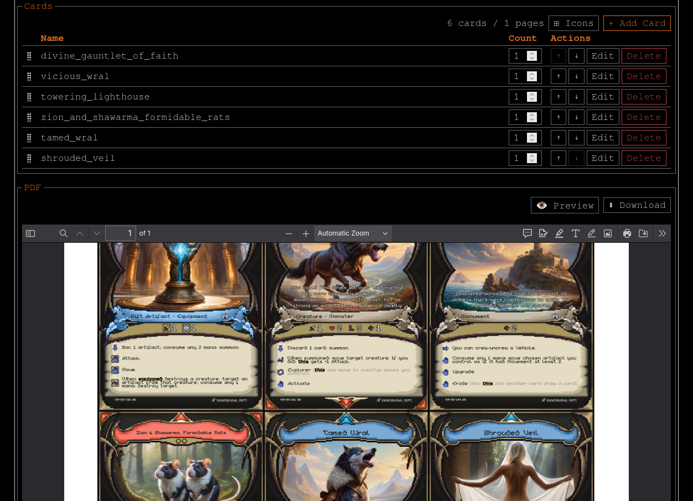

# card-press

[](https://github.com/luanpotter/card-press/actions/workflows/ci.yaml)



[Card Press](https://luan.xyz/projects/card-press) is a fully client-side webapp for generating print-then-cut PDFs for playing cards.

In particular, it provides a built-in template that works with the Cricut Maker cutting machine (but it supports defining arbitrary templates).

Leave a ⭐ if you find it useful!

## Development

To setup and run locally, use the provided scripts:

```bash
./scripts/setup.sh # optional, installs bun and linting tools
./scripts/build.sh # builds the project to a dist folder
./scripts/lint.sh [--fix] # lints the code, use --fix to auto-fix issues
```

To run locally, use the bun dev server:

```bash
bun run dev
```

Feel free to send any issues and pull requests!
